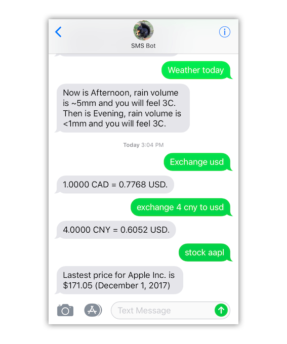

# SMS Bot



Project for [UBC Hacks' Local Hack Day 2017](https://hackday.mlh.io/ubchacks?em=537). To fulfill the theme "accessibility," we aim to provide information services for people unable to access the internet (e.g., elders).

## Capabilities

### Weather (Vancouver)

We provide rain volume and temperature (feel) information. (provider: [The Weather Network](https://www.theweathernetwork.com))

```
weather now
weather today
weather tomorrow
```

### Stock Price
(provider: [IEX](https://iextrading.com))

```
stock appl
stock fb
```

### Exchange Rate
(provider: [Fixer](http://fixer.io))

```
exchange 3 CAD to usd
exchange RUB to usd
exchange HKD
exchange 0.8 gbp
```

### UBC Professor Phone
(provider: [UBC](http://ubc.ca))

```
ubc prof well smith
ubc prof john doe
```

## Tech Details

- [Twilio](https://www.twilio.com/) for sending/receiving SMS
- [AWS Lambda](https://aws.amazon.com/lambda/) for backends. 